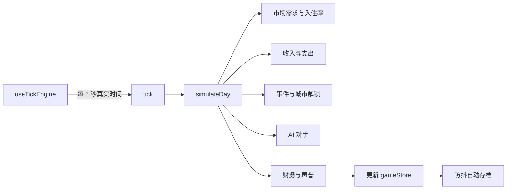
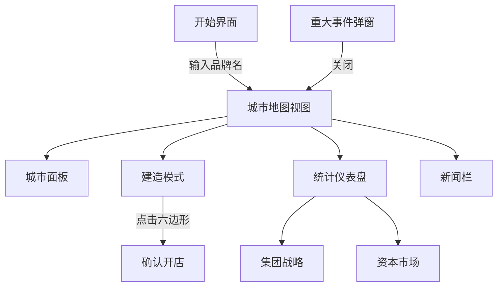
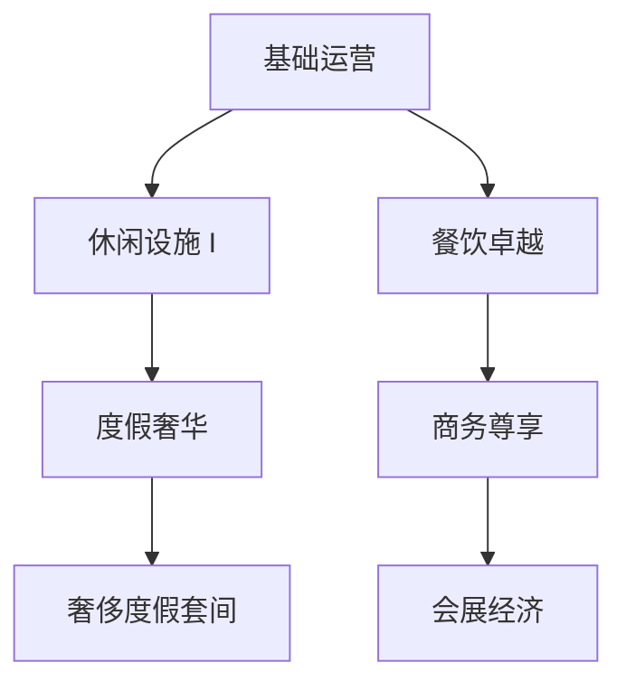

# SimHotel 项目文档

本文档描述技术架构、交互设计、UI 风格与核心游戏系统。长期产品方向见 [GAME_DESIGN_ROADMAP.md](./GAME_DESIGN_ROADMAP.md)。

---

## 1. 产品概览

**SimHotel** 是一款基于 Mapbox 真实世界地图的浏览器端宏大战略酒店经营游戏。玩家从 1990 年香港起步，在逐步解锁的城市中建立酒店品牌，与 AI 集团竞争，应对历史事件，并在数十年间管理资本、声誉与区域扩张。

| 属性 | 值 |
|------|-----|
| 平台 | Web（桌面优先，响应式移动端） |
| 开局日期 | 1990-01-01 |
| 初始资金 | $8,000,000 |
| 起点城市 | 香港 |
| 语言 | 中文（默认）、英文 |

---

## 2. 技术架构

### 2.1 技术栈

| 层级 | 技术 | 职责 |
|------|------|------|
| UI | React 18 + TypeScript | 组件树、面板、HUD |
| 构建 | Vite 5 | 开发服务器、生产打包 |
| 地图 | Mapbox GL JS + react-map-gl | 真实地理、城市标记、六边形落子网格 |
| 状态 | Zustand + Immer | 单一 `gameStore`，类不可变更新 |
| 模拟 | 自研 Tick 引擎 | `requestAnimationFrame` 循环，固定日长 |
| 动画 | Framer Motion | 数字过渡、弹窗 |
| 图表 | Recharts | 统计仪表盘时序图 |
| 持久化 | Dexie.js（IndexedDB） | 防抖自动存档 |
| 国际化 | i18next + react-i18next | 中英文文案 |
| 测试 | Vitest（单元）、Playwright（E2E） | 财务、事件、市场、冒烟流程 |

### 2.2 目录结构

```
src/
├── components/
│   ├── hud/          # 顶栏：日期、资金、暂停、快进下月
│   ├── map/          # Mapbox 地图、六边形网格、图层、城市切换
│   ├── panels/       # 开始界面、城市/建造面板、新闻、事件
│   ├── charts/       # 统计仪表盘（业务 / 宏观 / 战略）
│   └── ui/           # Button、Card、AnimatedNumber
├── game/
│   ├── engine/       # simulateDay、useTickEngine、日期工具
│   ├── market/       # 需求、份额分配、区位评分
│   ├── ai/           # 竞争对手建造与定价决策
│   ├── events/       # 重大/普通历史事件
│   ├── finance/      # 债务、信用评级、利息
│   ├── world/        # 城市指标随年份演化
│   └── save/         # IndexedDB 读写、自动存档钩子
├── data/
│   ├── cities/       # 城市配置、边界、档案
│   ├── events/       # 重大与普通事件定义
│   ├── competitors/  # AI 集团人格
│   └── grid/         # 六边形网格生成、噪声采样
├── stores/
│   └── gameStore.ts  # 游戏状态与动作
└── i18n/
    └── index.ts      # 翻译资源
```

### 2.3 模拟循环



**时间模型（当前）：**

- 1 个游戏日 = **5,000 ms** 真实时间（`useTickEngine.ts` 中的 `MS_PER_GAME_DAY`）。
- 无倍速倍率（已移除 1x / 2x / 4x 控制）。
- **暂停** 停止累加器；**继续** 恢复推进。
- **快进下月** 对每一天调用 `simulateDay`，直至下月 1 日。若触发重大事件，模拟暂停并打开事件弹窗（与正常 tick 一致）。

**当日现金变化：**

- `dailyCashDelta = dailyRevenue - dailyExpense - dailyInterest`
- 存入 `GameState`，在 HUD 中显示为 `$8,000,000 (+$12,000)`（正数为青色，负数为珊瑚色）。

### 2.4 状态管理

所有玩法状态位于 `useGameStore`（Zustand + Immer）。主要域：

- **日历：** `date`、`paused`
- **经济：** `cash`、`dailyCashDelta`、`debt`、`creditRating`、`financeHistory`
- **资产：** `hotels[]`、`unlockedCities[]`
- **世界：** `worldSeed`、`worldMetrics`、`activeEvents`、`newsFeed`
- **UI：** 面板可见性、地图图层、选中城市/酒店、教程步骤
- **战略：** `strategyPolicy`（稳健 / 扩张 / 奢华 / 精益 / 防守）

动作方面：tick 与快进调用 `simulateDay`；建造、调价、借贷等玩家指令直接变更状态。

### 2.5 持久化

- `setupAutoSave()` 订阅 store 变化，400 ms 防抖写入。
- 标签页隐藏 / `pagehide` 时立即刷盘。
- `pickPersistedState()` 保存前剥离临时 UI 标志。
- 读档时迁移旧存档（如缺少 `dailyCashDelta`、酒店网格单元等）。

### 2.6 地图与选址

- 城市使用边界框；**开城**需在统计总览「扩张」页支付 `unlockFee`（香港开局免费）。**无年份限制**，资金充足即可购买任意未开市场。
- 酒店吸附到每城 **六边形网格**；每格仅一栋建筑。
- **区位质量** 在网格坐标采样人口 / 经济 / 旅游噪声。
- **数据图层** 在地图上叠加人口（青绿）、经济（琥珀）、旅游（珊瑚）热力。

### 2.7 环境变量

| 变量 | 必填 | 说明 |
|------|------|------|
| `VITE_MAPBOX_TOKEN` | 是 | Mapbox 公开 token（`.env.local`，勿提交 Git） |

---

## 3. 交互设计

### 3.1 核心流程



### 3.2 HUD（顶栏）

| 控件 | 行为 |
|------|------|
| 日期 + 品牌名 | 只读状态 |
| 资金 | `$总额 (+$变化)` — 变化为最近模拟日净现金 |
| 声誉 | 0–100 分 |
| 信用（桌面端） | 评级 + 负债（百万美元） |
| 暂停 / 继续 | 切换模拟推进 |
| 快进下月 | 批量模拟至下月 1 日；遇重大事件则停止 |
| 开店 | 打开建造面板 + 选址模式 |
| 统计 | 打开仪表盘（默认「扩张」标签）；地图收缩为顶部条带 |
| 新闻 | 侧边面板，未读角标 |
| EN / 中 | 语言切换 |

### 3.3 地图交互

- **点击城市标记** — 选中城市、飞入、打开城市面板。
- **点击酒店标记** — 打开酒店详情 Dialog（概览、统计、经营、广告、收购）。
- **建造模式** — 点击六边形格；预览需求加成；进入空间配置向导。
- **图层切换器**（Mapbox 控件）— 切换人口 / 经济 / 旅游热力。
- **城市切换器** — 在已解锁城市间跳转。

### 3.4 面板

| 面板 | 用途 |
|------|------|
| 城市面板 | 市场数据、档案（原型、机会、风险）、玩家酒店列表 |
| 建造面板 | 选址 + 空间配置向导（客房、设施、品牌定位、成本估算） |
| 统计仪表盘 | 标签页：扩张、技术、营销、财务、业务、市场、宏观、战略 |
| 新闻 | 普通事件与市场头条 |
| 事件弹窗 | 重大历史事件；关闭前游戏暂停 |
| 教程浮层 | 任务式引导（查看城市 → 建造 → 战略 → 新闻） |

### 3.5 反馈原则

- **重大事件暂停** — 玩家确认后方继续推进时间。
- **数字动画** — 资金与声誉使用弹簧动画，保持连续感。
- **资金不足** — 建造/升级/借贷返回 false；UI 在已实现处显示禁用状态。
- **自动存档** — 无手动保存按钮；状态变更即持久化。

### 3.6 无障碍与移动端

- 刘海屏安全区内边距（`safe-top`、`safe-x`）。
- 窄屏下 HUD 横向滚动。
- 统计布局：地图 45vh + 下方可滚动仪表盘。
- 移动端图层控件 reposition，避免与 HUD 重叠。

---

## 4. UI 风格指南

### 4.1 设计方向

**深色地图上的浅色战术 UI** — 磨砂卡片浮于深灰蓝地图画布之上。珊瑚色强调资金与紧迫；青绿色表示正向指标与旅游图层。字体组合：人文无衬线（Noto Sans SC / DM Sans）+ JetBrains Mono 用于数字。

### 4.2 色彩 Token

定义于 `src/index.css`（`@theme`）：

| Token | 色值 | 用途 |
|-------|------|------|
| `--color-map-bg` | `#1a1f2e` | 页面 / 地图衬底背景 |
| `--color-card` | `#f8f9fb` | 面板与 HUD 表面（95% 不透明 + 模糊） |
| `--color-card-dark` | `#eef1f5` | 悬停、次级表面 |
| `--color-accent` | `#ff6b4a` | 资金、警告、旅游图层、主 CTA |
| `--color-accent-hover` | `#ff5533` | 强调色悬停/激活 |
| `--color-teal` | `#2dd4bf` | 正向变化、人口图层 |
| `--color-teal-dark` | `#14b8a6` | 声誉、正向 KPI |
| `--color-muted` | `#64748b` | 标签、次要文字 |
| `--color-border` | `#e2e8f0` | 分隔线 |

卡片正文 `#1e293b`；开始界面主视觉区为白字。

### 4.3 字体层级

| 角色 | 字体 | 字号（移动 → 桌面） |
|------|------|---------------------|
| HUD 标签 | sans | 10px → 12px，muted |
| HUD 数值 | mono | 12px → 14px，semibold |
| 面板标题 | sans | 16px–20px，bold |
| 开始页主标题 | sans | 36px–48px，bold |

### 4.4 组件规范

- **卡片：** `rounded-xl`；弹窗 `shadow-2xl`；HUD 使用 `bg-card/95 backdrop-blur-sm`。
- **按钮：** 变体 `primary`（强调填充）、`secondary`（卡片填充）、`ghost`（纯文字）；HUD 内 `size="sm"`。
- **AnimatedNumber：** Framer 弹簧（`stiffness: 80`，`damping: 20`），`font-mono`。
- **地图控件：** 自定义图层面板 — 12px 圆角，激活态强调色。

### 4.5 数据图层图例渐变

- 人口：青绿渐变
- 经济：琥珀 → 橙
- 旅游：珊瑚 → 红

### 4.6 动效

- 弹窗进出场：`EventModal`、教程步骤使用 Framer Motion。
- 地图飞入：通过 `FlyToController` 的 Mapbox 缓动镜头。
- Tick 时不过度动效；数字平滑过渡即可。

---

## 5. 游戏系统

### 5.1 开城（市场扩张）

**原则：无时间限制，仅受资金约束。**

| 规则 | 说明 |
|------|------|
| 解锁条件 | 玩家支付一次性 `unlockFee` 即可开城 |
| 无年份门槛 | 不再按游戏年份锁定城市；资金充足即可进入任意未开市场 |
| 香港 | 开局默认已开，`unlockFee = 0` |
| 费用定价 | 按城市规模、战略价值与竞争强度分级（如 $2M–$15M） |

开城入口：统计仪表盘 → **扩张** 标签。开城后可在该城市地图落子建新酒店或收购既有物业。

---

### 5.2 酒店经营（空间模型）

用统一的 **空间（Space）** 单位替代「选星级即固定客房数」的粗粒度模型。每栋酒店有：

| 字段 | 含义 |
|------|------|
| `spaceTotal` | 可分配空间上限（通过购地、扩建提升） |
| `spaceUsed` | 客房 + 公共设施已占用空间 |
| `spaceFree` | `spaceTotal - spaceUsed` |

#### 5.2.1 客房类型与空间消耗

| 房型 | 空间消耗 | 目标客群 | 备注 |
|------|----------|----------|------|
| 大床房 | 1 | 散客、情侣 | 基础房型 |
| 双人间 | 1 | 散客、小家庭 | 与大床同级消耗 |
| 6 人宿舍 | 1.5 | 背包客、学生 | 高入住密度、低单价 |
| 套间 | 2 | 商务、家庭 | 客厅+卧室 |
| 豪华套间 | 3 | 高端商务 | 需基础餐厅解锁 |
| 尊享行政套间 | 4 | 高管、贵宾 | 需行政酒廊技术 |
| 奢侈度假套间 | 5 | 奢华度假客 | 需度假设施技术 |

- 设置客房 = 选择房型 + 数量；实时校验 `spaceFree >= 消耗`
- 删除客房释放空间（有拆除成本时可设小额费用）
- 客房数量驱动 **可售房间数**、清洁人力需求与收入上限

#### 5.2.2 公共设施与空间消耗

**开业最低配置（硬性要求）：**

- 大堂（必选，消耗 3 空间）
- 至少 3 间客房（任意类型）

**可选设施：**

| 设施 | 空间消耗 | 解锁 | 效果 |
|------|----------|------|------|
| 洗衣房 | 2 | 默认 | 降低运营成本，提升长住满意度 |
| 游泳池 | 4 | 技术：休闲设施 I | 提升度假客群吸引力 |
| 餐厅 | 3 | 默认 | 基础餐饮收入，商务便餐 |
| 高级餐厅 | 5 | 技术：餐饮卓越 | 高客单价、奢华评分 |
| 健身房 | 2 | 技术：休闲设施 I | 商务客留存 |
| 行政酒廊 | 3 | 技术：商务尊享 | 解锁行政套间溢价 |
| 会议中心 | 6 | 技术：会展经济 | 承接商务会展需求 |
| SPA | 4 | 技术：度假奢华 | 度假高端客群 |

设施占用空间计入 `spaceUsed`；高级设施须在 **技术** 页面解锁后方可建造（见第 5.3 节）。

#### 5.2.3 扩建空间

- **横向扩建**：同地块加层/扩翼，成本随当前 `spaceTotal` 递增
- **耗时**：大型扩建需若干游戏日施工（可快进跳过）
- 区位差的地块初始 `spaceTotal` 较低，但扩建成本也较低

#### 5.2.4 建设页面流程

1. 地图选址（六边形格）→ 支付购地/基建费，获得初始 `spaceTotal`
2. 进入 **酒店建设页**（Dialog 内 Tab 或独立向导）：
   - 放置必选：大堂 + ≥3 客房
   - 分配剩余空间给可选设施与更多客房
   - 实时预览：空间条、预估成本、目标客群、开业最低标准校验
3. 确认后进入施工状态，完工后开业

#### 5.2.5 酒店详情 Dialog

点击地图上的酒店标记（玩家自有或竞争对手）时，打开 **酒店详情 Dialog**（全屏或大型居中弹窗）。

**信息展示：**

- **概览**：名称、星级/档次、区位评分、入住率、日均收入、品质、声誉贡献
- **空间**：总空间 / 已用空间 / 剩余空间
- **客房构成**：各房型数量与占比
- **公共设施**：已建设施列表及等级
- **人员**：经营团队规模与人力成本
- **过往经营**：Recharts 时序图——入住率、收入、支出、净利润（7/30/90 日可切换）

**经营操作（仅玩家自有酒店）：**

| 操作 | 说明 |
|------|------|
| **扩建空间** | 消耗资金与时间，增加酒店可分配空间上限 |
| **设置客房** | 在剩余空间内增删改客房类型 |
| **装修** | 提升品质与目标客群满意度；有冷却与成本 |
| **雇佣经营人员** | 前台、客房、餐饮、工程等；影响服务品质与运营成本 |
| **调价** | 调整各房型或均价 |
| **打广告** | 跳转广告子面板（见第 5.4 节） |
| **卖出** | 将酒店挂牌出售，获得现金（估值见第 5.2.6 节） |

竞争对手酒店：只读模式，展示公开信息；玩家可发起 **收购要约**。

#### 5.2.6 酒店收购与出售

**收购他人酒店：**

```
估值 = 基础资产价值 × 区位系数 × 经营系数 × 声誉系数
收购价 = 估值 × 议价系数（0.85–1.15，受双方关系、酒店困境程度影响）
```

- **合理价格**：系统给出建议区间；过高 AI 拒绝，过低 AI 拒绝或反还价
- **困境收购**：入住率持续低迷、所有者现金流紧张时，议价系数向玩家倾斜
- **收购后**：保留既有空间布局与设施，可立即改造

**出售自有酒店：**

- 挂牌价可在估值 ±20% 内设定
- 模拟日中 AI 或「市场买家」按概率出价
- 出售后该网格格释放，可重新建造

---

### 5.3 技术树

统计仪表盘 **技术** 标签（或与战略并列）。

#### 5.3.1 解锁方式

每项技术需同时满足：

- **金钱**：一次性研发/引进费用
- **时间**：研发持续若干游戏日（显示进度条，可快进）
- **前置科技**：科技树 DAG 依赖

#### 5.3.2 科技分支



解锁后：对应公共设施、房型、广告形式变为可建造/可使用。

---

### 5.4 广告系统

#### 5.4.1 投放层级

| 层级 | 范围 | 成本模型 | 效果 |
|------|------|----------|------|
| **集团品牌广告** | 全集团、全城市 | 高预算、按日计费 | 提升品牌认知、全店需求基线 |
| **单店广告** | 指定酒店 | 中低预算 | 提升该店本地需求与特定客群占比 |

#### 5.4.2 广告形式与客群

| 形式 | 目标客群 | 典型渠道 | 效果侧重 |
|------|----------|----------|----------|
| 地铁/公交灯箱 | 本地散客、预算型 | 城市通勤 | 入住率、低价房型 |
| 机场到达厅 | 商务、中转旅客 | 交通枢纽 | 商务房型、短住 |
| 旅游杂志 / OTA 首页 | 度假、家庭 | 旅游媒体 | 度假套间、季节性波动平滑 |
| 财经媒体冠名 | 高管、会议 | 商务媒体 | 行政套间、会议设施 |
| 社交媒体种草 | 年轻背包客 | 线上 | 宿舍型、高传播低单价 |
| 奢华生活方式杂志 | 高净值度假 | 高端媒体 | 奢侈套间、高 ADR |

- 广告有 **持续天数** 与 **日预算**；到期效果衰减
- 同一客群多广告叠加有边际递减
- 历史事件（危机、旅游 boom）可放大或削弱广告 ROI

#### 5.4.3 UI 入口

- 酒店详情 Dialog → **广告** Tab
- 统计仪表盘 → **营销** Tab → 集团品牌广告

---

### 5.5 集团战略

| 战略 | 建造成本 | 运营成本 | 市场吸引力 | 声誉 |
|------|----------|----------|------------|------|
| 稳健 | 1.0× | 1.0× | 1.0× | 中性 |
| 扩张 | 0.88× | 1.04× | 0.97× | − |
| 奢华 | 1.12× | 1.10× | 1.12× | + |
| 精益 | 0.97× | 0.86× | 0.94× | 略 − |
| 防守 | 1.03× | 0.92× | 1.02× | + |

---

### 5.6 事件

- **重大：** 暂停游戏、全屏弹窗、按 `durationDays` 施加市场修正。
- **普通：** 写入新闻 feed，带类别标签与效果摘要。
- 事件可链式修正旅游、商务出行、需求、人口、经济等维度。

---

### 5.7 财务

- 按资产与评级计算授信额度，可借/还款。
- 未偿债务按日计息。
- 信用评级 AAA → Distressed，由杠杆与现金缓冲决定。

---

### 5.8 AI 竞争对手

人格：激进、价格战、高端、区域型。周期性调整建造与定价；在模拟中分摊收入与支出。AI 对手同样使用空间模型；可被收购或出售。

---

### 5.9 与现有系统的关系

| 现有系统 | 调整方向 |
|----------|----------|
| 星级（3/4/5★） | 逐步弱化为「品牌定位标签」，或由设施+房型组合推导 |
| 建造面板 | 演进为「选址 + 空间配置向导」 |
| 地图点击酒店 | 打开详情 Dialog，不再仅在侧栏显示调价 |
| 开城 | **已明确**：仅 `unlockFee`，移除 `unlockYear` 购买门槛 |
| 模拟 Tick | 需纳入：扩建工期、研发进度、广告效果、人员成本、设施加成 |
| AI 对手 | 同样使用空间模型；可被收购或出售 |

---

## 6. 测试

```bash
npm run test      # Vitest 单元测试
npm run test:e2e  # Playwright（开始界面、新局冒烟）
```

单元测试重点：财务公式、事件触发、市场份额、六边形网格、世界指标。

---

## 7. 实现状态

| 模块 | 状态 | 主要代码 |
|------|------|----------|
| 开城（仅资金） | ✅ | `cityUnlock.ts`, `ExpansionTab.tsx` |
| 空间数据模型 | ✅ | `types.ts`, `game/hotel/space.ts` |
| 建设空间向导 | ✅ | `BuildPanel.tsx`, `HotelBuildWizard.tsx` |
| 酒店详情 Dialog | ✅ | `HotelDetailModal.tsx` |
| 客房/设施/人员/扩建 | ✅ | `game/hotel/operations.ts`, `gameStore` |
| 技术树 | ✅ | `game/tech/tech.ts`, `TechTab.tsx` |
| 收购/出售 | ✅ | `game/hotel/acquisition.ts`, `valuation.ts` |
| 广告系统 | ✅ | `game/marketing/ads.ts`, `MarketingTab.tsx` |

---

## 8. 开放设计问题

- 空间单位是否随城市地价缩放（香港 1 空间 ≠ 曼谷 1 空间）？
- 出售酒店后，同一格是否冷却期禁止立即重建？
- 集团广告是否受集团声誉上限约束？
- 6 人宿舍等高密度房型是否触发当地监管事件？

---

## 9. 相关文档

| 文档 | 内容 |
|------|------|
| [GAME_DESIGN_ROADMAP.md](./GAME_DESIGN_ROADMAP.md) | 长期愿景、里程碑、内容路线图 |
| [README.md](../README.md) | 快速开始、技术栈摘要、玩法说明 |

---

## 10. 修订记录

| 日期 | 变更 |
|------|------|
| 2026-06 | 合并 HOTEL_OPERATIONS_DESIGN.md；空间模型、技术树、广告、并购内容并入第 5 节 |
| 2026-06 | 固定 5 秒/日节奏；移除倍速；新增快进下月；资金 HUD 显示当日变化 |
| 2026-06 | 开城移除年份门槛；空间机制、详情 Dialog、技术树、并购、广告系统全面落地 |
